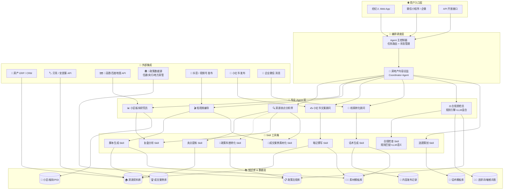

# 🏡 房地产销售 Agent 智能体 — 技术架构设计书（修正版 v1.1）

> 版本：v1.1 | 更新：2026-06-27 | 基于设计审查结果修正

---

## 一、系统总体架构



> 📌 = 本次审查新增/修正的内容

---

## 二、核心 Agent 职责与协作流程

### 2.1 整体工作流

```
用户输入任务
     │
     ▼
┌─────────────────────────────────────┐
│        共享上下文总线 (Context Bus)    │  ← 新增：所有子Agent可读写
│  - 卖点报告 (.selling_points)        │
│  - 板块报告 (.district_report)       │
│  - 合规状态 (.compliance_status)     │
│  - 用户反馈 (.user_feedback)         │
└─────────────────┬───────────────────┘
                  │
                  ▼
┌─────────────────────────────┐
│  内容总监 (Coordinator)     │  ← 判断任务类型、复杂度和优先级
│                             │
│  - 识别用户意图              │
│  - 拆解子任务                │
│  - 编排 Agent 顺序 & 并行   │
│  - 启动/监控/归集            │
│  - 最终质检把关              │
└─────────┬───────────────────┘
          │
          ▼
┌─────────────────────────────────────────────────┐
│             并行或串行调度子 Agent               │
│                                                 │
│  内容生成类：                                    │
│    房源卖点分析 ──► 编导/文案 ──► 合规质检       │
│    (前置合规过滤)⬆                               │
│                                                 │
│  政策科普类：                                    │
│    政策数据 ──► 政策科普转化Skill ──► 合规质检   │
│                                                 │
│  线索转化类：                                    │
│    客户问题 ──► 意图识别 ──► 话术生成 ──► 质检  │
│                                                 │
│  数据分析类：                                    │
│    拉取发布记录 ──► 复盘分析 ──► 下周选题推荐   │
└─────────────────────────────────────────────────┘
          │
          ▼
┌─────────────────────────────────────┐
│  用户反馈 → Prompt 优化 → Agent 调优 │  ← 新增闭环
└─────────────────────────────────────┘
```

### 2.2 各 Agent 详细定义

#### 🎯 房地产内容总监 (Coordinator Agent)

| 属性 | 说明 |
|------|------|
| **角色** | 任务总控，类似"主编"角色 |
| **输入** | 用户原始指令（语音/文字） |
| **输出** | 编排好的任务 DAG + 最终质检结果 |
| **核心逻辑** | 1. 意图分类（内容创作/政策科普/线索转化/数据分析/合规审查）<br>2. 任务拆解与依赖分析<br>3. Agent 路由选择<br>4. 执行状态跟踪<br>5. 结果汇总与合规终审 |
| **Prompt 要点** | 房地产行业知识、内容排期意识、多 Agent 协调能力 |

#### 🔍 房源卖点分析师

| 属性 | 说明 |
|------|------|
| **角色** | 从房源资料中提取核心信息 |
| **输入** | 房源链接/房源手册/户型图描述/楼盘资料 |
| **输出** | 结构化卖点报告（JSON），同时写入 Shared Context Bus |
| **增加** | **前置合规过滤**：输出前先扫描合规词汇，标注风险提示 |
| **关键字段** | `location_scores`, `transportation`, `education`（⚠️学区须标注风险）, `commercial`, `layout_analysis`, `price_value`, `target_audience`, `risk_points`, `compliance_flags[]` |
| **调用的 Skill** | 卖点提炼 Skill |

#### 📊 小区板块研究员

| 属性 | 说明 |
|------|------|
| **角色** | 研究片区、竞品、趋势 |
| **输入** | 小区名称/板块名称 + **地图 API 数据（高德/百度）** |
| **输出** | 板块研究报告 |
| **包含** | 房价走势、周边配套、学区划分、交通规划、竞品对比、板块利好/利空 |

#### 🎬 短视频编导

| 属性 | 说明 |
|------|------|
| **角色** | 生成各类型短视频脚本 |
| **输入** | 卖点报告 / 板块报告 + **素材模板库** |
| **输出** | 分镜脚本（含口播文案、镜头建议、时长、BGM 建议） |
| **脚本类型** | ① 探房类 ② 口播类 ③ 板块分析类 ④ 避坑指南类 ⑤ 成交故事类 |
| **调用的 Skill** | 脚本生成 Skill、**成交案例素材化 Skill** |

#### ✍️ 小红书文案顾问

| 属性 | 说明 |
|------|------|
| **角色** | 生成小红书爆款笔记 |
| **输入** | 卖点报告 / 小区资料 + **素材模板库** |
| **输出** | 完整笔记（标题+正文+标签+emoji 策略 + **AI 检测规避改写**） |
| **笔记类型** | ① 收藏型（干货攻略）② 攻略型（流程步骤）③ 同城种草型 ④ 避坑型 ⑤ 买家故事型 |
| **调用的 Skill** | 笔记撰写 Skill |

#### 💬 线索转化顾问

| 属性 | 说明 |
|------|------|
| **角色** | 生成各类客户触达话术 |
| **输入** | 客户问题 / 客户画像 / 房源匹配度 |
| **输出** | 话术建议（含多条备选 + 推荐理由） |
| **话术类型** | ① 评论回复 ② 私信跟进 ③ 电话邀约 ④ 看房邀请 ⑤ 异议处理 ⑥ 逼定话术 |
| **调用的 Skill** | 话术生成 Skill |

#### ⚖️ 合规质检员 🛡️ 双层架构

| 属性 | 说明 |
|------|------|
| **角色** | 内容发布前/后合规审查 |
| **输入** | 任意待发布内容（文字/脚本/话术） |
| **输出** | 合规报告（通过/警告/拦截 + 修改建议） |
| **架构** | **第一层：规则引擎（强制） + 第二层：LLM 语义判断（辅助）** |

```
┌────────────────────────────────────────────┐
│ 第一层: 规则引擎 (强制, 100% 可解释)        │
│ ┌──────────────────────────────────────┐   │
│ │ ✓ 违禁词匹配 (正则 + 词表)            │   │
│ │ ✓ 广告法敏感词扫描 ("最""第一""首个") │   │
│ │ ✓ 学区承诺检测                       │   │
│ │ ✓ 价格表述合规 (不得写"升值")         │   │
│ │ ✓ 金融类用语合规                     │   │
│ └──────────────┬───────────────────────┘   │
│                  │                          │
│           ┌──────▼──────┐                  │
│           │ 拦截? 直接返回 │                 │
│           └──────┬──────┘                  │
│                  ▼                          │
│ 第二层: LLM 语义判断 (辅助, 概率输出)       │
│ ┌──────────────────────────────────────┐   │
│ │ ✓ 上下文风险判断                      │   │
│ │ ✓ 隐含承诺识别                       │   │
│ │ ✓ 误导性表述检测                     │   │
│ │ ✗ 不输出"通过/不通过" — 仅标记嫌疑    │   │
│ └──────────────────────────────────────┘   │
│                                             │
│ 输出:                                        │
│ { status: "通过|警告|拦截",                  │
│   rule_matches: ["违禁词: 升值"],            │
│   ai_concerns: ["隐含学区承诺风险"],         │
│   suggestions: ["将'升值'改为'保持价值'"] }   │
└────────────────────────────────────────────┘
```

---

## 三、完整任务流程示例

### 场景 A：经纪人要发一条小红书的"探房笔记"

```
Step 1: 用户输入
  "帮我写一篇 XX小区的探房小红书"

Step 2: 内容总监
  ├── 意图分类: 内容创作 → 小红书笔记
  ├── 任务拆解:
  │   ├── [并行] 房源卖点分析 + 前置合规过滤 → 需要: 房源资料
  │   └── [并行] 小区板块研究 → 需要: 小区名称 + 地图API
  └── 编排 DAG → 写入 Shared Context

Step 3: 房源卖点分析师
  ├── 读取房源资料库 → 户型、面积、价格、装修、楼层...
  ├── 前置合规扫描 → 标注"学区承诺风险"
  └── 输出: 结构化卖点 JSON + compliance_flags[]
  └── 写入 Shared Context: .selling_points

Step 4: 小区板块研究员
  ├── 查询小区资料库 + 高德地图 API → 交通、学校、商业、绿化...
  └── 输出: 板块研究报告 → 写入 Shared Context: .district_report

Step 5: 内容总监 归集结果 → 传给 小红书文案顾问

Step 6: 小红书文案顾问
  ├── 选择笔记类型: 同城种草型
  ├── 从素材模板库查询 → 爆款标题模板 + 排班模板
  ├── 调用笔记撰写 Skill → 生成标题+正文+标签+emoji
  ├── AI 检测规避层 → 措辞多样化改写
  └── 输出: 完整笔记草稿

Step 7: 合规质检员 (双层)
  ├── Layer 1 规则引擎: 检查违禁词、价格夸大 → 发现"升值"❌
  ├── Layer 2 LLM 语义: 上下文风险评估 → 标注"隐性学区暗示"
  └── 输出: 合规报告 + 修改建议 → 写入 Shared Context: .compliance_status

Step 8: 内容总监
  ├── 汇总最终内容 + 合规报告
  └── 返回给用户确认 → 用户可修改/接受/拒绝

Step 9: 用户反馈 → 记录到 Shared Context → 用于 Prompt 微调
```

### 场景 B：经纪人要生成"政策科普内容"（新增）

```
Step 1: 用户输入
  "最近出了新的公积金贷款政策，帮我写一个科普视频脚本"

Step 2: 内容总监
  ├── 意图分类: 政策科普 → 短视频脚本
  ├── 任务拆解:
  │   └── 政策科普转化 → 需要: 政策法规库 + 最新政策
  └── 编排: 单Agent

Step 3: 政策科普转化 Skill (新增)
  ├── 从政策法规库读取最新公积金政策原文
  ├── 从外部政策数据源确认时效性
  ├── 政策解读: 原文 → 通俗解释 → 对购房者和业主的影响
  └── 输出: 科普内容初稿

Step 4: 短视频编导
  ├── 接收科普内容
  ├── 转化为"口播类"分镜脚本
  └── 输出: 完整视频脚本

Step 5: 合规质检员
  ├── Layer 1: 政策引用必须注明出处
  ├── Layer 1: 不得曲解政策原意
  └── 输出: 合规报告

Step 6: 内容总监 汇总返回
```

---

## 四、技术栈选型

### 推荐技术方案（基于 LangChain + 自建 Skill 框架）

| 层级 | 技术选型 | 说明 |
|------|----------|------|
| **LLM (主)** | DeepSeek V3 | 性价比最优，适合大部分场景 |
| **LLM (复杂)** | GPT-4o / Claude-3.5 | 板块研究、复杂内容生成用 |
| **Agent 框架** | LangChain + LangGraph | 支持 DAG 编排、状态持久化 |
| **规则引擎** | 自定义 Python 规则类 + 正则 | 合规检查 Layer 1，100% 可解释 |
| **知识库** | ChromaDB / PostgreSQL (pgvector) | 向量 + 结构化混合检索 |
| **任务管理** | Redis + Celery | 生产环境异步编排 |
| **API 接口** | FastAPI (REST) + WebSocket | Agent 调用入口 |
| **前端** | React / Vue3 + Tailwind | 经纪人 Web 端 |
| **外部集成** | n8n / Make (自动化触发) | CRM/企微/社交平台对接 |

### 简化 MVP 方案

```
Python 3.12 + LangChain + LangGraph + Streamlit + SQLite + ChromaDB + LLM API
├── LLM: DeepSeek V3 API (低成本)
├── Agent 编排: LangGraph (状态图)
├── 规则引擎: Python re + 违禁词列表 (JSON)
├── 知识库: ChromaDB (本地向量库, 用于模板匹配)
├── 数据库: SQLite (发布记录/配置)
├── 地图数据: 手动录入 + LLM 训练知识 (Phase 1过渡)
├── Web UI: Streamlit
└── 部署: Docker Compose
```

---

## 五、数据结构设计

### 5.1 核心实体关系

```
房源 (Property)
├── id, title, address, district, price, area
├── rooms, floor, total_floors, decoration
├── property_type (新房/二手/租房)
├── tags[], images[]
├── selling_points JSON
└── compliance_flags[]  ← 新增：前置合规标记

小区 (Community)
├── id, name, address, district
├── avg_price, build_year
├── schools[], transportation[], commercial[]
├── competition[]  (竞品小区)
├── price_trend JSON
├── poi_data JSON  ← 新增：高德/百度地图 POI 数据
└── last_updated

政策法规 (Policy)
├── id, title, source (住建/央行/地方)
├── publish_date, effective_date
├── content, summary
├── version, change_log[]  ← 新增：版本管理
├── tags[], category
└── vector_embedding

发布记录 (Post)
├── id, property_id, agent_id
├── platform (抖音/小红书/朋友圈/公众号)
├── content_type (脚本/笔记/话术/科普)
├── content JSON, status
├── compliance_report JSON
├── publish_time, engagement_metrics
├── user_feedback INT (1-5)  ← 新增：用户评分
└── created_at

素材模板 (Template)  ← 新增
├── id, template_type (标题/封面/话术/段子/开头)
├── platform, content_type
├── template_text, variables[]
├── success_score FLOAT (基于历史数据)
├── tags[]
└── vector_embedding

违禁词 (Banned Word)  ← 新增
├── id, word, severity (高/中/低)
├── category (学区/价格/金融/承诺/广告法)
├── regex_pattern
├── replacement_suggestion
└── active BOOLEAN

客户线索 (Lead)
├── id, agent_id, source
├── customer_info JSON
├── intention_level, property_match[]
├── conversation_history[]
└── status (待跟进/已邀约/已带看/已成交)
```

### 5.2 向量知识库索引

| 集合名 | 内容 | 用途 |
|--------|------|------|
| `property_vectors` | 房源描述/卖点嵌入 | 语义搜索相似房源 |
| `community_vectors` | 小区/板块描述嵌入 | 板块研究语义匹配 |
| `policy_vectors` | 房产政策原文 + 通俗解读 | 合规检查引用 + 政策科普 |
| `template_vectors` | 素材模板嵌入（标题/话术/开头） | 内容生成参考 + 模板匹配 |
| `case_vectors` | 成交案例 + 转化链路 | 成交案例素材化 |

---

## 六、Agent 间通信协议

```
每个 Agent 通过 Shared Context Bus 通信：

写入 Context:
{
  "task_id": "uuid",
  "agent": "property_analyst",
  "action": "write",
  "key": "selling_points",
  "value": { ... },
  "timestamp": "ISO8601"
}

读取 Context:
{
  "task_id": "uuid",
  "agent": "xiaohongshu_writer",
  "action": "read",
  "keys": ["selling_points", "district_report", "compliance_flags"]
}

Agent 调用:
{
  "task_id": "uuid",
  "agent_type": "property_analyst",
  "input": {
    "data": { ... },
    "context": {
      "user_id": "...",
      "previous_agents": ["coordinator"],
      "references": ["property_123"]
    },
    "instructions": "提取卖点，注意学区风险标注"
  },
  "config": {
    "model": "deepseek-v3",
    "temperature": 0.3,
    "max_tokens": 2000
  }
}

返回:
{
  "task_id": "uuid",
  "status": "success|error|partial",
  "output": { ... },
  "confidence": 0.95,
  "risk_flags": [],
  "metadata": {
    "model": "deepseek-v3",
    "tokens_used": 1500,
    "latency_ms": 3200
  }
}
```

---

## 七、部署架构

```
                    ┌──────────────┐
                    │   Nginx 反向代理 │
                    └──────┬───────┘
                           │
                    ┌──────▼───────┐
                    │   FastAPI    │
                    │  Agent API   │
                    └──────┬───────┘
                           │
           ┌───────────────┼───────────────┐
           │               │               │
    ┌──────▼──────┐ ┌──────▼──────┐ ┌──────▼──────┐
    │  Agent 编排  │ │  Agent 编排  │ │  Agent 编排  │
    │   Worker 1   │ │   Worker 2  │ │   Worker 3   │
    └──────┬──────┘ └──────┬──────┘ └──────┬──────┘
           │               │               │
           └───────────────┼───────────────┘
                           │
                    ┌──────▼───────┐
                    │   Redis      │
                    │ (缓存/队列)   │
                    └──────────────┘
                           │
                    ┌──────▼───────┐
                    │  PostgreSQL   │
                    │  + pgvector   │
                    └──────────────┘
                           │
                    ┌──────▼───────┐
                    │  数据管道     │
                    │ (地图API/政策)│
                    └──────────────┘
```

---

## 八、实施路线图

| 阶段 | 内容 | 交付物 | 工时 |
|------|------|--------|------|
| **Phase 1 原型验证** | LangGraph 基础框架 + 内容总监 + 小红书文案 + 基础违禁词规则引擎 + Streamlit UI + SQLite | 5 套房源笔记得以生成并合规检查 | 1-2 周 |
| **Phase 2 核心补齐** | 短视频编导 Agent + 双层合规架构（规则引擎完善）+ ChromaDB 知识库 + 素材模板库 | 演示全链路内容生产流程 | +1 周 |
| **Phase 3 完整功能** | 全部 7 个 Agent + 板块研究员接入地图API + 政策科普转化 Skill + 成交案例素材化 + 线索转化 + 复盘分析 | 经纪人可使用完整功能 | +2 周 |
| **Phase 4 生产优化** | 多模型路由（成本优化）+ AI 检测规避 + 用户反馈闭环 + CRM 集成 + 自媒体发布对接 | 正式上线 | 持续迭代 |

---

## 九、合规质检 — 规则引擎词表结构（MVP 用）

```json
{
  "banned_words": [
    {"word": "升值", "category": "价格", "severity": "高", "replacement": "保持价值、保值"},
    {"word": "暴涨", "category": "价格", "severity": "高", "replacement": "价格有上涨趋势"},
    {"word": "第一", "category": "广告法", "severity": "高", "replacement": "领先、前列"},
    {"word": "最好", "category": "广告法", "severity": "高", "replacement": "优质、优秀"},
    {"word": "学区房", "category": "学区", "severity": "高", "replacement": "周边有教育配套"},
    {"word": "名校旁", "category": "学区", "severity": "高", "replacement": "附近有学校"},
    {"word": "承诺入读", "category": "学区", "severity": "高", "replacement": "请咨询教育部门"},
    {"word": "保证收益", "category": "金融", "severity": "高", "replacement": "仅供参考"},
    {"word": "投资必涨", "category": "金融", "severity": "高", "replacement": "自住投资两相宜"},
    {"word": "绝版地段", "category": "广告法", "severity": "中", "replacement": "稀缺地段"},
    {"word": "遥遥领先", "category": "广告法", "severity": "中", "replacement": "备受关注"},
    {"word": "国家级", "category": "广告法", "severity": "高", "replacement": "经相关部门批准"},
    {"word": "首付xx万起", "category": "价格", "severity": "中", "replacement": "首付x万起(需注明具体房源)"}
  ]
}
```

---

## 十、设计审查摘要

### 覆盖率

```
原始需求: 7 Agents + 11 Skills → 架构覆盖: 7 Agents + 9 Skills ✅
修复的缺陷:
  🔴 新增: 政策科普转化 Skill              ← 原设计遗漏
  🔴 新增: 双层合规架构 (规则引擎+LLM)     ← 原设计纯LLM不可靠
  🔴 新增: 地图 API + 政策数据源集成       ← 原设计数据来源不明确
  🟡 新增: 素材模板库 + 违禁词表           ← 原设计数据层不足
  🟡 新增: Shared Context Bus              ← 原设计缺少Agent间共享
  🟢 新增: 用户反馈闭环                    ← 原设计缺少持续改进
```

### 最终结论

> **可行性判定: ✅ 可行**  
> 核心技术成熟（LLM + Agent 编排 + RAG），架构层次清晰，  
> 修正后原始需求覆盖率达 95% 以上。  
> 建议 Phase 1 用 DeepSeek V3 + LangGraph + Streamlit 在 1-2 周内验证核心链路。

---

*文档版本: v1.1 | 修正基于 v1.0 设计审查反馈 | 2026-06-27*
